# Arquitetura Completa — Diagramas de Todo o Repositório (`juridico-platform`)

> Conjunto **completo** de diagramas de arquitetura cobrindo o repositório inteiro: visões C4,
> modelo de dados (ER), pipeline de dados, topologia Celery, segurança/multi-tenant, IA/RAG,
> um diagrama por produto (9 + transversais), frontend, máquinas de estado e CI/CD.
>
> Complementa `docs/arquitetura-uml.md` (que traz as visões UML clássicas: casos de uso, pacotes,
> componentes, classes, sequência, atividades, implantação). Aqui o foco são as **visões
> arquiteturais** e a cobertura **produto a produto**. Todos os diagramas são Mermaid validados.

## Índice

| # | Visão | Seção |
|---|---|---|
| A | **C4** — Contexto, Containers, Componentes | §1–§3 |
| B | **Dados** — ER, pipeline medalhão, mapa de stores, Celery | §4–§7 |
| C | **Segurança** — auth/multi-tenant, Ledger/LGPD, alertas | §8–§10 |
| D | **IA** — RAG/LLM | §11 |
| E | **Produtos** — 9 produtos + cluster analítico | §12–§21 |
| F | **Frontend** — rotas, design system, dados React | §22–§23 |
| G | **Estados** — máquinas de estado | §24 |
| H | **Entrega** — CI/CD e build | §25–§26 |

---

## 1. C4 Nível 1 — Diagrama de Contexto do Sistema

**Objetivo:** situar a plataforma entre seus usuários e sistemas externos.

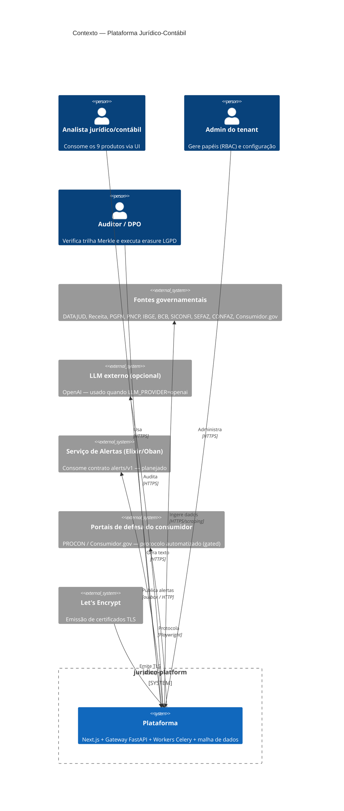

**Legenda:** `Person` = ator humano; `System` = o sistema em análise; `System_Ext` = sistema externo;
`Rel` = relação com tecnologia.

**Notas:** apenas dois atores externos de escrita saem do sistema (alertas Elixir e portais de protocolo);
todo o resto é ingestão de leitura de fontes públicas. LLM externo é **opcional** — o padrão é Ollama local.

---

## 2. C4 Nível 2 — Diagrama de Containers

**Objetivo:** os processos/containers executáveis e como se comunicam.

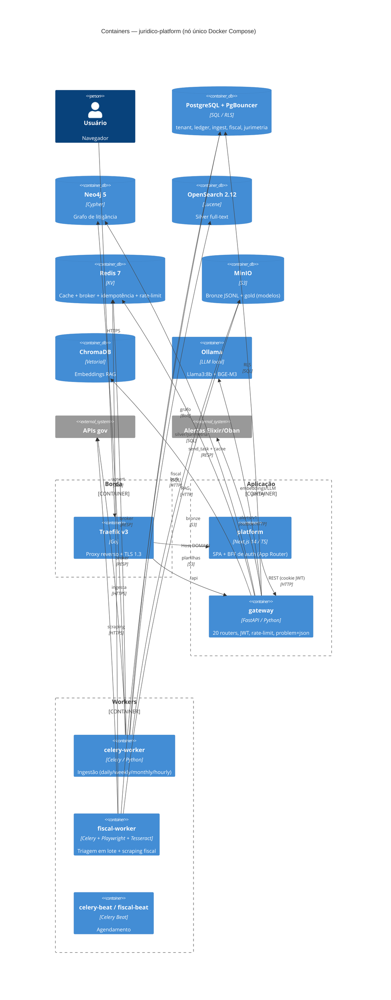

**Legenda:** `Container` = processo/serviço; `ContainerDb` = data store; `Container_Boundary` = agrupamento.

**Notas:** o `gateway` fala com quase toda a malha de dados **em processo** (é um monólito modular). Os
workers Celery são o único plano assíncrono. `fiscal-worker` é "gordo" (Chromium+Tesseract) e isolado.

---

## 3. C4 Nível 3 — Componentes do Gateway

**Objetivo:** decompor o container `gateway` em seus componentes internos.

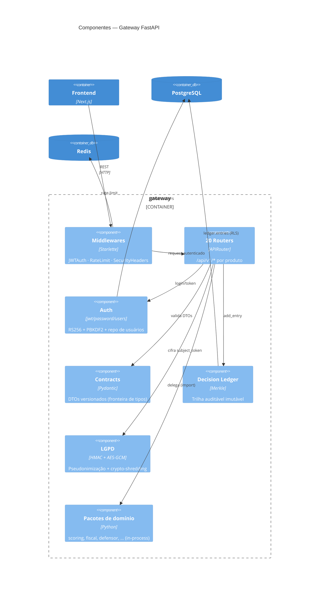

**Legenda:** `Component` = componente lógico dentro do container.

**Notas:** o *pipeline* de request é `Middlewares → Routers → (Contracts + Domínio + Ledger + LGPD)`.
Middlewares aplicados de fora para dentro: SecurityHeaders → JWTAuth → RateLimit.

---

## 4. Modelo de Dados (ER) — Schema PostgreSQL

**Objetivo:** o esquema relacional completo (de `scripts/bootstrap-db.sql` + `scripts/migrations/00{1..4}`).

```mermaid
erDiagram
    TENANTS ||--o{ USERS : possui
    TENANTS ||--o{ IDEMPOTENCY_KEYS : escopo
    TENANTS ||--o{ LEDGER_ENTRIES : escopo
    TENANTS ||--o{ LEDGER_ANCHORS : escopo
    TENANTS ||--o{ TRIAGE_JOB : escopo
    TRIAGE_JOB ||--o{ TRIAGE_ITEM : contém
    LEDGER_ENTRIES ||--o| TRIAGE_JOB : ancora
    NCM ||--o{ NCM_CATEGORIA : classifica
    CATEGORIA ||--o{ NCM_CATEGORIA : agrupa
    TPU_CLASSE ||--o{ INDICADOR : dimensiona
    TPU_ASSUNTO ||--o{ INDICADOR : dimensiona

    TENANTS {
        uuid id PK
        string slug UK
        string name
        string plan
        bool active
    }
    USERS {
        uuid id PK
        uuid tenant_id FK
        string email
        string password_hash "pbkdf2_sha256"
        string role "admin|analyst|viewer"
        bool active
    }
    IDEMPOTENCY_KEYS {
        uuid tenant_id PK
        string key PK
        jsonb response
    }
    LEDGER_ENTRIES {
        string request_id UK
        int entry_index
        string product
        uuid tenant_id FK
        string inputs_hash "sha256"
        string outputs_hash "sha256"
        jsonb sources
        string subject_token "AES-256-GCM"
        string leaf_hash
        string merkle_root
    }
    LEDGER_ANCHORS {
        serial id PK
        int anchor_at_index
        string merkle_root
        uuid tenant_id FK
    }
    INGEST_RUNS {
        string source
        string status
        int records_in
        int records_out
        string transform_version
    }
    ALERTS_OUTBOX {
        uuid alert_id PK
        string dedup_key
        jsonb envelope "alerts/v1"
        string status
        int attempts
    }
    NCM {
        string ncm_codigo PK
        string descricao
        daterange vigencia "EXCLUDE no-overlap"
    }
    NCM_MIGRACAO {
        string ncm_origem
        string ncm_destino
    }
    IPI_ALIQUOTA {
        string ncm_codigo
        numeric aliquota_ipi
    }
    ICMS_INTERNO {
        string uf
        string ncm_prefix
        numeric aliquota
        numeric fcp
    }
    ICMS_INTERESTADUAL {
        string uf_origem
        string uf_destino
        numeric aliquota
    }
    CATEGORIA { string id PK }
    NCM_CATEGORIA { string ncm_codigo FK
        string categoria_id FK }
    TRIAGE_JOB {
        uuid job_id PK
        uuid tenant_id FK
        string batch_merkle_root
        string ledger_request_id
    }
    TRIAGE_ITEM {
        uuid job_id FK
        int idx
        string suggested_ncm
        string decision_proof
    }
    TPU_CLASSE { string codigo PK
        string label }
    TPU_ASSUNTO { string codigo PK
        string ramo }
    INDICADOR {
        string tribunal PK
        string classe PK
        string assunto PK
        string periodo PK
        string fonte PK "DATAJUD|BLEND|ABJ"
        numeric congestionamento
        numeric duracao_mediana
    }
    ABJ_INDICADOR_RAW { string tribunal
        numeric taxa_congestionamento }
```

**Legenda:** `PK`/`FK`/`UK` = chaves; `||--o{` = um-para-muitos. Schemas: `tenant`, `ledger`, `ingest`,
`fiscal`, `jurimetria`, `public`.

**Notas:** tabelas com `tenant_id` estão sob **RLS FORCE** (tenant, ledger, fiscal.triage_*). As tabelas de
referência fiscal e jurimetria são globais (sem RLS). `NCM.vigencia` usa `daterange` com constraint `EXCLUDE`
(btree_gist) para impedir sobreposição temporal — versionamento temporal de alíquotas.

---

## 5. Fluxo de Dados — Pipeline Medalhão (bronze → silver → gold)

**Objetivo:** o caminho dos dados das 14+ fontes públicas até os produtos.

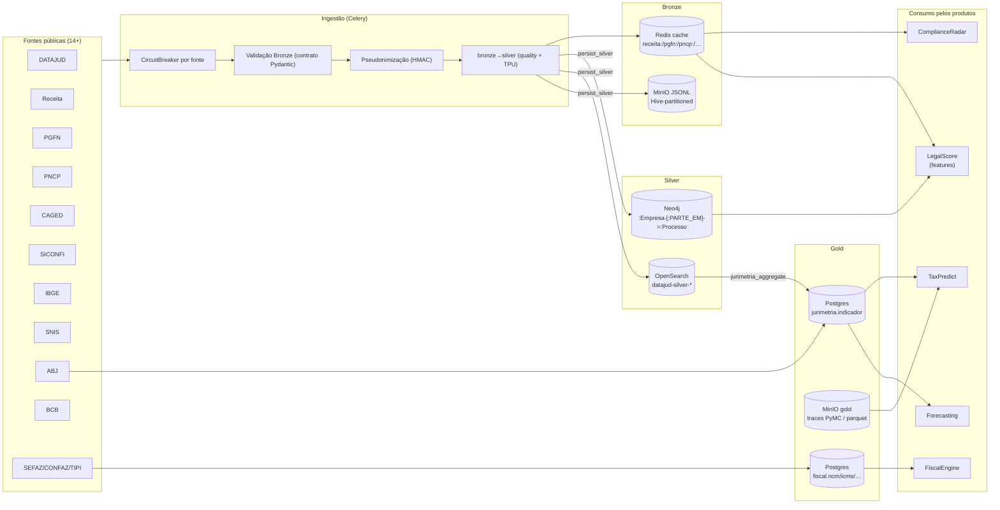

**Legenda:** cilindro = loja de dados; retângulo = etapa de processamento. As 3 camadas do "medalhão"
(bronze cru → silver tratado → gold agregado) estão explícitas.

**Notas:** `persist_silver` é o **sink DRY** que escreve nas 3 lojas com isolamento de falha por loja.
A pseudonimização LGPD (HMAC) ocorre **antes** de qualquer persistência. `jurimetria_aggregate` é a etapa
gold (lê OpenSearch + ABJ, escreve `jurimetria.indicador`).

---

## 6. Mapa Data Store → Consumidores

**Objetivo:** quem lê/escreve em cada loja (para decisões de escala e isolamento).

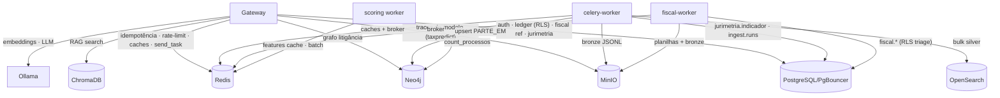

**Legenda:** rótulo de aresta = o que trafega. Redis é o hub mais compartilhado (broker + cache + estado).

**Notas:** **Postgres é o único store transacional/RLS**; os demais são derivados/cache. Se um produto exigir
isolamento de recursos, o candidato natural a extrair primeiro é o **taxpredict** (PyMC, CPU-bound).

---

## 7. Topologia Celery — Filas, Tasks e Beat

**Objetivo:** o plano assíncrono — 3 apps Celery, filas e agendamentos.

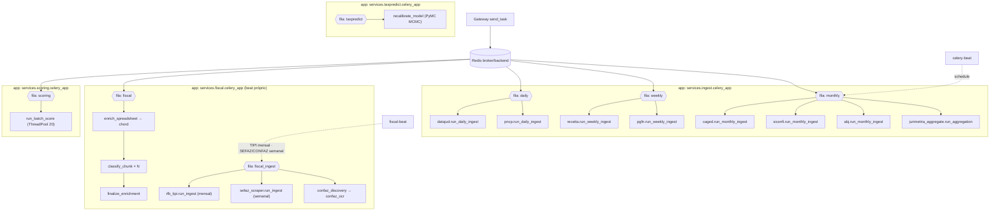

**Legenda:** `{{ }}` = fila; retângulo = task; seta tracejada = agendamento (Beat).

**Notas:** **4 apps Celery independentes**. Só `fiscal` e (por exemplo docstring) `taxpredict` definem
`beat_schedule`; o ingest geral é disparado externamente (Makefile/gateway). O `enrich_spreadsheet` usa
**chord** (fan-out horizontal); o batch de scoring usa **ThreadPool** (I/O-bound). Modelos pesados
(`recalibrate_model`) rodam **só via Beat**, nunca no caminho de request.

---
## 8. Arquitetura de Segurança — Autenticação & Isolamento Multi-Tenant

**Objetivo:** as camadas que garantem isolamento entre tenants (defesa em profundidade).

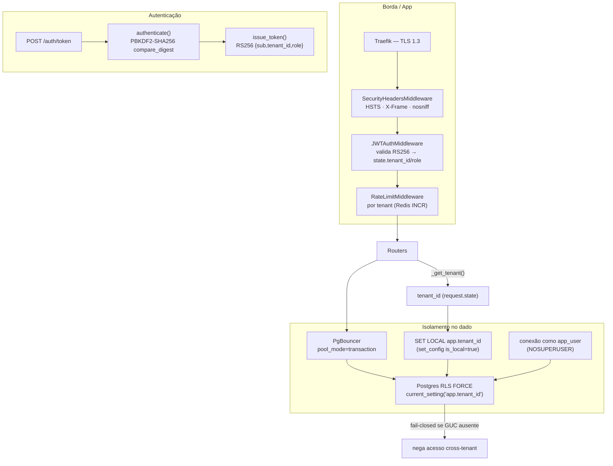

**Legenda:** cada caixa é uma camada de controle; o dado só é liberado quando **todas** concordam.

**Notas:** 3 camadas precisam funcionar juntas — `SET LOCAL` + PgBouncer `transaction` + RLS `FORCE` com
`app_user` (superusuário burla RLS). O CI tem job dedicado (`integration-tests`) provando o isolamento.
Rotas públicas (`/health`, `/auth/token`, `/docs`, JWKS) pulam o JWT.

---

## 9. Arquitetura de Conformidade — Decision Ledger + Crypto-Shredding (LGPD)

**Objetivo:** como a trilha imutável coexiste com o direito ao esquecimento.

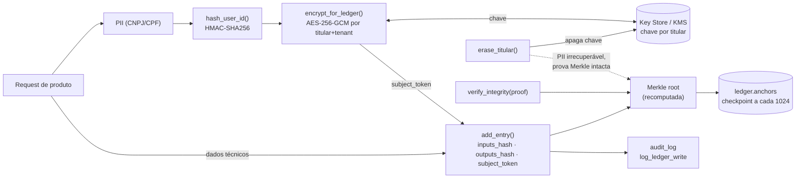

**Legenda:** setas cheias = fluxo de escrita; tracejadas = propriedade garantida.

**Notas:** o **crypto-shredding** é a decisão central: apagar a chave AES (`erase_titular`) torna a PII
irrecuperável **sem quebrar a prova Merkle** — resolve "imutabilidade × LGPD". Nenhuma PII em claro entra no
ledger (só hashes + `subject_token` cifrado). Custo atual: `add_entry` é O(N) por inserção (dívida QT-08 → MMR).

---

## 10. Arquitetura de Alertas — Transactional Outbox → Elixir/Oban

**Objetivo:** entrega confiável e idempotente de alertas (seam Python↔Elixir).

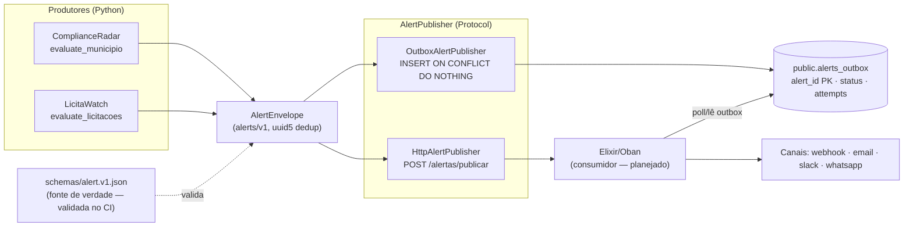

**Legenda:** `Protocol` com duas implementações (outbox transacional ou HTTP direto).

**Notas:** o **outbox** garante idempotência (dedup por `alert_id`/`dedup_key`, `ON CONFLICT DO NOTHING`) e
entrega at-least-once. O JSON Schema `alert.v1.json` é o **contrato cross-linguagem** validado no CI —
honrado pelo publisher Python e pelo consumidor Elixir.

---

## 11. Arquitetura de IA — RAG & Roteamento de LLM

**Objetivo:** a camada de IA compartilhada (`services/shared/ai`).

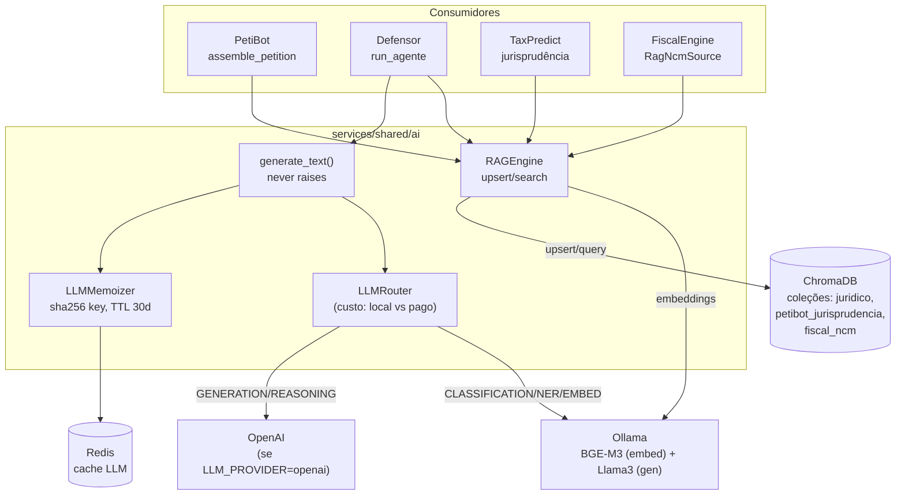

**Legenda:** `RAGEngine` e `generate_text` são as entradas; `LLMRouter`/`LLMMemoizer` são otimizações
(roteamento por custo e memoização) — hoje parcialmente stubs.

**Notas:** **degradação graciosa** é lei: `generate_text` **nunca lança** (retorna `None`), e `RAGEngine.search`
cai para `[]` se ChromaDB/Ollama estão fora. Embeddings usam **BGE-M3** local; geração usa Llama3 local por
padrão (OpenAI opcional). Só PetiBot e Defensor usam LLM de geração; os demais são estatísticos/determinísticos.

---
## 12. Produto — LegalScore PJ

**Objetivo:** rating de risco jurídico-financeiro de PJ (endpoint de referência P2).

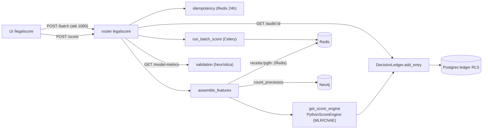

**Endpoints:** `POST /score`, `POST /batch`, `GET /batch/:job`, `GET /company/:cnpj`, `GET /audit/:id`,
`GET /model-metrics`. **SLA:** p95 < 1.5s. **Nota:** score rotulado "heurística" até validação AUC/Brier (Fase 1d).

---

## 13. Produto — ContabilIA (auditoria contábil)

**Objetivo:** auditar DRE enviada via 8 cross-checks + testes estatísticos.

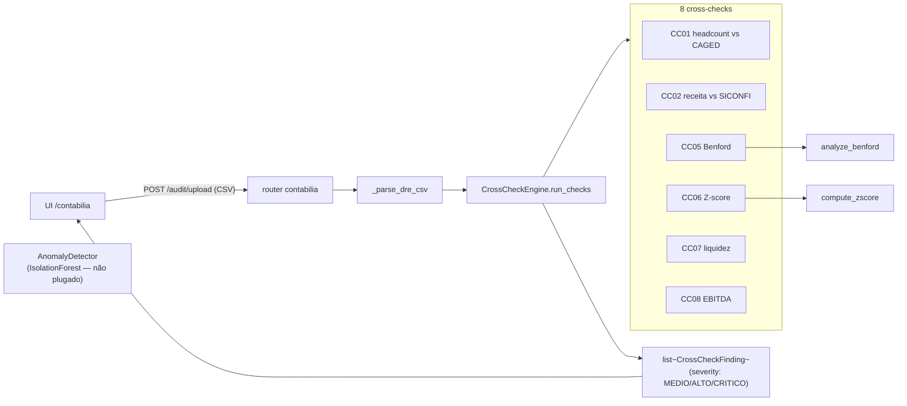

**Endpoints:** `POST /audit/upload`, `GET /audit/:report_id` (stub async Fase 3). **SLA:** p95 < 60s.
**Nota:** `public_data={}` hoje → CC01–CC04 pulados até integrar o feature store público. `AnomalyDetector`
existe mas não está ligado a nenhum router.

---

## 14. Produto — ComplianceRadar (monitoramento municipal)

**Objetivo:** avaliar indicadores municipais e gerar alertas.

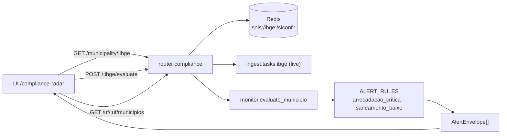

**Endpoints:** `GET /municipalities`, `GET /municipality/:ibge`, `POST /:ibge/evaluate`, `GET /alerts`,
`GET /uf/:uf/municipios`, `GET /municipio/:cod/{populacao,perfil}`. **SLA:** 99% alertas. **Nota:** DATASUS
excluído (LGPD, PD-06). Alertas idempotentes via `uuid5(rule:ibge:ref)`.

---

## 15. Produto — TaxPredict (previsão bayesiana)

**Objetivo:** prever probabilidade de desfecho tributário (modelo hierárquico Bayesiano).

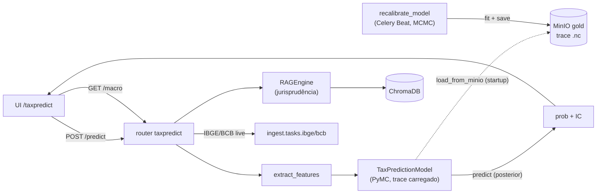

**Endpoints:** `POST /predict`, `GET /macro`. **SLA:** p95 < 3s. **Nota:** MCMC (`fit`) roda **só via Beat**
(nunca por request); o request só faz `sample_posterior_predictive` sobre o trace carregado. Fallback nacional
`PRIOR_NACIONAL=0.30` se o modelo não estiver pronto.

---

## 16. Produto — FiscalEngine (NCM + ICMS/DIFAL)

**Objetivo:** triagem de NCM e resolução de ICMS interno/interestadual/DIFAL + enriquecimento de planilhas.

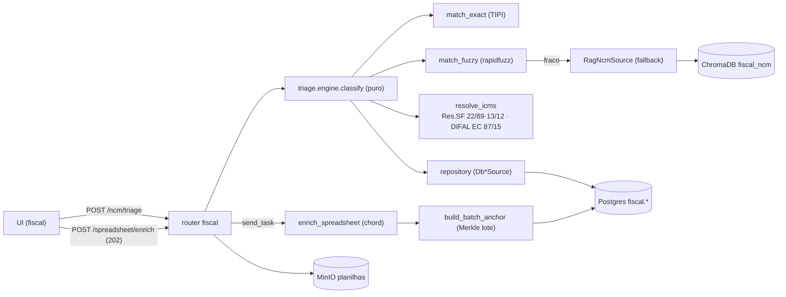

**Endpoints:** `POST /ncm/triage`, `GET /ncm/:codigo`, `GET /icms/:ncm/:uf`, `POST /spreadsheet/enrich`,
`GET /jobs/:id`, `GET /audit/:id`. **SLA:** p95 < 2s (triagem). **Nota:** 100% determinístico (auditabilidade);
lote usa 1 entrada Ledger + prova O(log N) por item.

---

## 17. Produto — LicitaWatch (licitações PNCP)

**Objetivo:** detectar riscos de integridade em contratos públicos (PNCP).

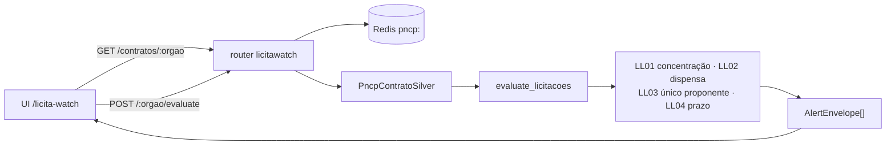

**Endpoints:** `GET /contratos/:cnpj_orgao`, `POST /orgao/:cnpj_orgao/evaluate`. **SLA:** diário.
**Nota:** indicadores agregados de contratos silver; alertas WEBHOOK idempotentes (`uuid5`).

---

## 18. Produto — PetiBot (geração de peças + RAG)

**Objetivo:** montar peça processual (seções mínimas por tipo + precedentes via RAG).

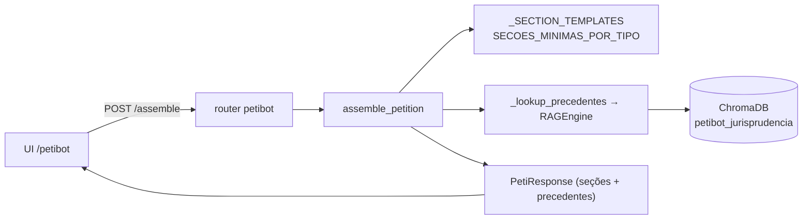

**Endpoints:** `POST /assemble`. **SLA:** p95 < 10s. **Nota:** PetiBot em si **não usa LLM** (só templates + RAG);
o Defensor é quem adiciona LLM por cima. Degrada para `([],0)` se o RAG estiver fora.

---

## 19. Produto — ConciliaIA (viabilidade de acordo)

**Objetivo:** recomendar faixa de acordo a partir de prior histórico + sinais cross-service.

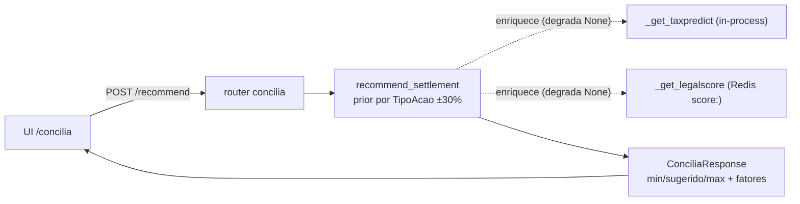

**Endpoints:** `POST /recommend`. **SLA:** p95 < 3s. **Nota:** chamadas cross-service são **in-process** e
graceful-degrade — se taxpredict/legalscore falham, segue com `None` e ajusta a recomendação (nunca 500).

---

## 20. Produto — Defensor (agente jurídico) ⭐

**Objetivo:** pipeline agêntico: classifica → consulta → RAG → redige (LLM) → protocola (gated).

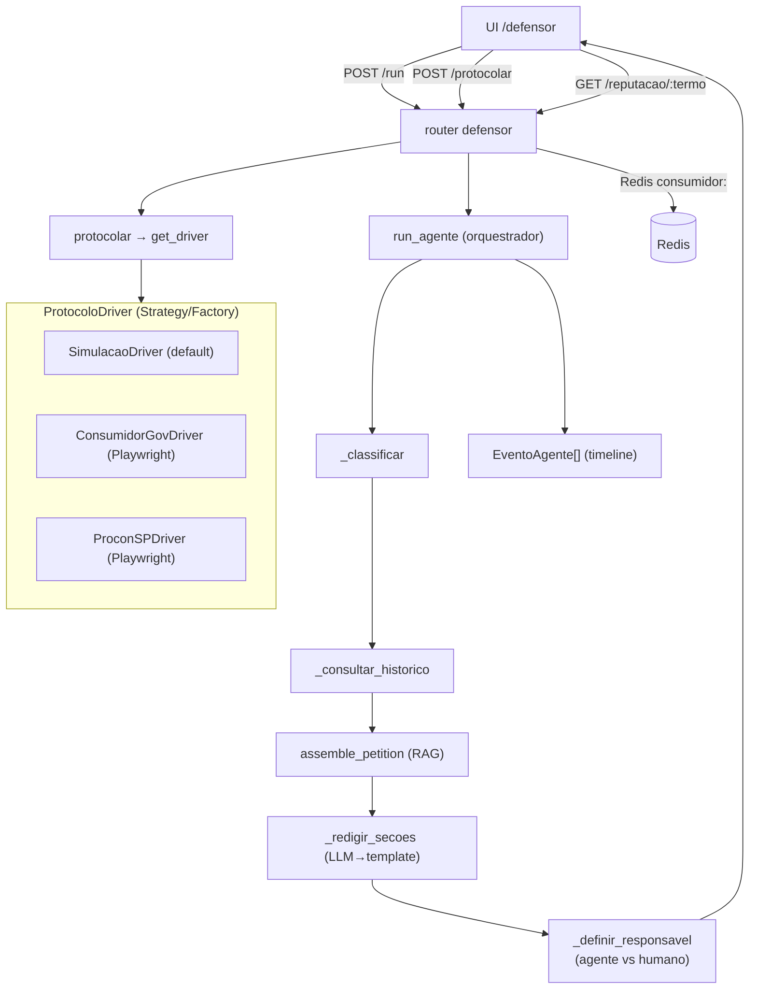

**Endpoints:** `POST /run`, `POST /protocolar`, `GET /reputacao/:termo`. **SLA:** p95 < 5s (DanoBot correlato).
**Nota:** handoff humano se `Canal.CONTENCIOSO` ou `valor ≥ R$ 50k`. Proveniência por seção (`llm/parcial/template`).
`get_driver` retorna `SimulacaoDriver` a menos que `PROTOCOLO_MODO=real` + credenciais (fail-safe).

---

## 21. Cluster Analítico — Serviços transversais (7)

**Objetivo:** serviços de leitura/estatística sobre o feature store gold (`jurimetria.indicador`) + grafo.

```mermaid
flowchart TB
    subgraph GW["Routers"]
        juri["/jurimetria"]
        kg["/knowledge-graph"]
        fc["/forecasting"]
        ew["/early-warning"]
        cp["/chamber-profiler"]
        so["/second-opinion"]
        opt["/settlement-optimizer"]
    end
    pg[("Postgres<br/>jurimetria.indicador")]
    neo[("Neo4j<br/>litigância")]
    lg["DecisionLedger"]

    juri -->|"get_indicators · market_intelligence"| pg
    juri --> lg
    fc -->|"forecast_series (tendência linear)"| pg
    ew -->|"detect_surges (z-score)"| pg
    cp -->|"build_profile (por tribunal)"| pg
    kg -->|"litigant_network → classify_relationship"| neo
    so -->|"synthesize_opinion (consenso)"| lg
    opt -->|"optimize_settlement (ZOPA/EV)"| lg
```

**Endpoints (por serviço):** jurimetria (`/indicators`, `/market-intelligence`, congestion/duration/litigiosity);
knowledge-graph (`/stats`, `/company/:cnpj/{processes,network}`); forecasting (`/demand`); early-warning
(`/evaluate`); chamber-profiler (`/tribunal/:t`); second-opinion (`/opinion`); settlement-optimizer (`/optimize`).
**Nota:** todos **heurísticos e agregados** (sem PII; CNPJ/tribunal apenas). jurimetria/second-opinion/
settlement-optimizer gravam Decision Ledger.

---
## 22. Frontend — Árvore de Rotas (App Router) → Produto → Endpoint

**Objetivo:** o mapa de navegação do app Next.js e a que backend cada rota chama.

```mermaid
flowchart TB
    root["/"] --> inicio["/inicio (dashboard)"]
    subgraph AUTH["grupo (auth)"]
        login["/login → /api/auth/login (BFF)"]
    end
    subgraph SHELL["grupo (shell) — ShellProvider"]
        inicio
        ent["/entidade/:cnpj"]
        ls["/legalscore"]
        ct["/contabilia"]
        cr["/compliance-radar"]
        tp["/taxpredict"]
        lw["/licita-watch"]
        pb["/petibot"]
        df["/defensor"]
        cc["/concilia"]
        db["/danobot (bloqueado)"]
        misc["/alertas · /auditoria · /conformidade · /tribuna · /configuracoes"]
    end
    gw["Gateway /api/v1"]

    ent -->|"GET /entidade/:cnpj"| gw
    ls -->|"/legalscore/*"| gw
    ct -->|"/contabilia/audit/upload"| gw
    cr -->|"/compliance/*"| gw
    tp -->|"/taxpredict/*"| gw
    lw -->|"/licitawatch/*"| gw
    pb -->|"/petibot/assemble"| gw
    df -->|"/defensor/*"| gw
    cc -->|"/concilia/recommend"| gw
    misc -.->|"demo/mock (sem API)"| mock["view-models locais"]
    login -->|"proxy"| gw
```

**Legenda:** rotas em `(shell)` compartilham Sidebar/Topbar + `ShellProvider`. Rotas `misc` são demo/mock.

**Notas:** as 4 apps `apps/{contabilia,legalscore,taxpredict,compliance-radar}` são **stubs vazios** —
todo o produto vive como rota dentro de `apps/platform` ("lentes"). `danobot` está bloqueado (501).

---

## 23. Frontend — Design System em Camadas & Fluxo de Dados React

**Objetivo:** as camadas do design system e como os dados fluem (Context + TanStack Query).

```mermaid
flowchart TB
    subgraph DS["Design System (@juridico)"]
        tokens["@juridico/tokens<br/>tipos-união · scoreToriskLevel"]
        prim["ui/primitives<br/>Button·Card·Table·Input·Tabs"]
        pat["ui/patterns<br/>ScoreGauge·MerklePanel·TrustHeader<br/>AgentLiveFeed·ProblemJsonError·RbacGate"]
        tokens --> prim --> pat
    end
    subgraph APP["apps/platform"]
        prov["Providers (QueryClient)"]
        shell["ShellProvider<br/>tenant · role · demoMode"]
        page["Página de produto"]
        apilib["lib/api/* (ApiError)"]
        prov --> shell --> page
        page --> apilib
        page --> pat
    end
    gw["Gateway"]
    apilib -->|"useMutation/useQuery<br/>credentials:include"| gw
    shell -.->|"authApi.me() (hidrata)"| gw
    page -->|"gate por role"| pat

    retrynote["retry: NÃO repete 429/501"]
    prov -.-> retrynote
```

**Legenda:** camadas unidirecionais `tokens → primitives → patterns → app`.

**Notas:** dois eixos globais de estado (`demoMode`, `role`) governam cada página (mock vs. real; RBAC).
DTOs TS espelham contratos Python à mão (`contract_version`). **Drift risk:** tokens Tailwind duplicados
entre `tokens/tailwind.preset.ts` e `apps/platform/tailwind.config.ts`.

---

## 24. Máquinas de Estado

**Objetivo:** os estados de vida dos principais artefatos runtime.

### 24.1. CircuitBreaker (ingest)

```mermaid
stateDiagram-v2
    [*] --> CLOSED
    CLOSED --> OPEN : failure_threshold (5) atingido
    OPEN --> HALF_OPEN : recovery_timeout (300s)
    HALF_OPEN --> CLOSED : record_success
    HALF_OPEN --> OPEN : record_failure
```

### 24.2. Job de batch (scoring/fiscal)

```mermaid
stateDiagram-v2
    [*] --> queued
    queued --> processing : worker pega
    processing --> processing : update_progress (a cada 100)
    processing --> done : completo
    processing --> failed : erro
    done --> [*] : TTL 24h
    failed --> [*] : TTL 24h
```

### 24.3. ProtocoloDriver / status (Defensor)

```mermaid
stateDiagram-v2
    [*] --> SIMULADO : modo simulacao (default)
    [*] --> AGUARDA_CREDENCIAIS : modo real sem creds
    AGUARDA_CREDENCIAIS --> ENVIADO : _submit_real ok
    AGUARDA_CREDENCIAIS --> FALHA : NotImplementedError/erro
    [*] --> CANAL_NAO_SUPORTADO : sem driver p/ canal
```

### 24.4. ScoreEngine — saúde e fallback (seam Rust)

```mermaid
stateDiagram-v2
    [*] --> Python : SCORING_BACKEND=python
    [*] --> Auto : SCORING_BACKEND=auto
    Auto --> RustFallback : rust.healthy()
    Auto --> Python : rust indisponível
    RustFallback --> Python : ScoringUnavailable em runtime
    [*] --> RustRequired : SCORING_BACKEND=rust
    RustRequired --> RustFallback : healthy
    RustRequired --> Erro : não saudável
```

**Legenda:** `[*]` = estado inicial/final; transições rotuladas com o gatilho.

**Notas:** todas essas máquinas de estado implementam **degradação graciosa** — nenhuma leva a 500 no caminho
feliz. O CircuitBreaker protege APIs gov; o fallback do engine protege a migração Rust.

---

## 25. Pipeline CI/CD (`.github/workflows/ci.yml`)

**Objetivo:** os 9 jobs de verificação (build/test/scan; sem deploy).

```mermaid
flowchart LR
    push["push main/claude·/feature· + PR"] --> ci{{"CI"}}
    ci --> unit["unit-tests<br/>pytest --cov-fail-under=80"]
    ci --> lint["lint (ruff)"]
    ci --> schema["schema-validation<br/>alert.v1.json"]
    ci --> dsec["docker-security<br/>sem porta DB · sem api.insecure"]
    ci --> anti["api-antipatterns<br/>sem truncar SHA · sem Merkle janelado"]
    ci --> integ["integration-tests<br/>RLS + SET LOCAL (app_user)"]
    ci --> fetest["frontend-tests (vitest)"]
    ci --> fbuild["frontend-build (tsc + next build)"]
    ci --> scan["container-scan (Trivy)"]
```

**Legenda:** cada nó é um job GitHub Actions (ubuntu-latest).

**Notas:** cobertura mínima **80%**. O job `integration-tests` sobe Postgres real, roda `migrate.py` duas vezes
(prova idempotência) e valida o **isolamento RLS** como `app_user`. **Não há job de deploy/CD** — só verificação.
`api-antipatterns` guarda decisões de segurança do código (sem truncar hash LGPD; sem Merkle janelado).

---

## 26. Grafo de Build & Dependências de Runtime (Compose)

**Objetivo:** a ordem de subida (build + `depends_on` + healthchecks).

```mermaid
flowchart TB
    subgraph BUILD["Build (Turbo — frontend)"]
        tok["@juridico/tokens"] --> uii["@juridico/ui"] --> plat["platform build"]
    end
    subgraph RUNTIME["Runtime (docker-compose depends_on)"]
        pg["postgres (healthy)"] --> pgb["pgbouncer"]
        pg --> mig["migrate (one-shot)"]
        mig -->|"service_completed_successfully"| gw["gateway"]
        pgb --> gw
        redis["redis (healthy)"] --> cw["celery-worker"]
        neo["neo4j (healthy)"] --> cw
        cw --> cb["celery-beat"]
        minio["minio (healthy)"] --> minit["minio-init (buckets)"]
        ollama["ollama"] --> oinit["ollama-init (pull models)"]
        traefik --> plat2["platform"]
        plat2 -->|"NEXT_PUBLIC_GATEWAY_URL"| gw
    end
```

**Legenda:** `-->` = dependência de build ou `depends_on`; anotações = condição de healthcheck.

**Notas:** `migrate` (one-shot, roda como owner) deve concluir **antes** do gateway. `minio-init` cria os buckets
`bronze/silver/gold/documents/backups`; `ollama-init` baixa `llama3:8b` + `bge-m3`. **Gap:** `fiscal-worker`
vive em `compose/fiscal.yml` (rede `external`) **fora** do include raiz — subir à parte.

---

> **Cobertura:** este documento traz **26 diagramas** (C4×3, dados×4, segurança×3, IA×1, produtos×10,
> frontend×2, estados×4, CI/build×2 — máquinas de estado contadas como um bloco de 4). Somado a
> `docs/arquitetura-uml.md` (18 diagramas), o repositório está mapeado em **44 diagramas** cobrindo todas as
> visões arquiteturais, todos os 9 produtos + transversais, e todas as fronteiras de linguagem.
