# Documentação UML — Plataforma Jurídico-Contábil (`juridico-platform`)

> Análise de arquitetura multi-linguagem para estudo aprofundado e planejamento de refatoramentos.
> Gerada a partir da inspeção estática de **270 arquivos Python**, **97 arquivos TypeScript/TSX** e de toda a
> configuração de infraestrutura (Docker Compose, CI, migrações SQL, contratos).

---

## 0. Sumário executivo

`juridico-platform` é uma plataforma **Docker-first** de IA aplicada ao direito e à contabilidade brasileira,
composta por **9 produtos** expostos sobre um **gateway FastAPI único** (monólito modular) e um **frontend
Next.js 14** (monorepo pnpm/Turbo). O backend é orquestrado por **Celery** para ingestão de dados públicos
(medalhão bronze→silver→gold) e trabalhos assíncronos, e persiste em uma malha poliglota de armazenamento
(PostgreSQL+RLS, Neo4j, OpenSearch, Redis, MinIO, ChromaDB, Ollama).

### 0.1. Nota sobre "multi-linguagem" (Python, Rust, TypeScript)

O prompt pede análise de **Python, Rust e TypeScript**. A realidade do repositório é:

| Linguagem | Situação no código | Evidência |
|---|---|---|
| **Python** | ✅ Presente — todo o backend (gateway, 20+ serviços, ingest, workers Celery). 270 arquivos `.py`. | `services/**` |
| **TypeScript** | ✅ Presente — todo o frontend (app Next.js + design system). 31 `.ts` + 66 `.tsx`. | `frontend/**` |
| **Rust** | ⚠️ **Ausente como código.** Existe apenas como **contrato/seam planejado**: o `Protocol` estrutural `ScoreEngine` foi desenhado para que, no futuro, um *crate* Rust via **PyO3** (`rust_scorer`) implemente exatamente a mesma interface e entre por **troca de configuração** (`SCORING_BACKEND=rust`). Hoje `RustScoreEngine` é um *adapter* que se auto-reporta como **não saudável**, e o `factory` cai para `PythonScoreEngine`. | `services/scoring/engine/engines.py:90`, `services/shared/contracts/scoring.py:82` |
| **Elixir** | ⚠️ Mencionado como **consumidor externo planejado** do contrato `alerts/v1` (fila Oban). Não há código Elixir no repositório; há o *publisher* Python (`HttpAlertPublisher`) que POSTa para um endpoint Elixir. | `services/shared/alerts/publishers.py`, `schemas/alert.v1.json` |

**Conclusão:** o sistema é hoje **Python + TypeScript**. As "fronteiras multi-linguagem" (Rust e Elixir)
são **seams arquiteturais** — `Protocol`s serializáveis e imutáveis — desenhados como pontos de extensão.
Essa é, na verdade, uma das decisões de arquitetura mais interessantes do projeto e é modelada
explicitamente nos diagramas de classes e componentes abaixo (estereótipo `«seam»`).

### 0.2. Como ler este documento

Cada diagrama traz: **Objetivo**, **Escopo**, o **código-fonte do diagrama** (Mermaid — renderiza nativamente
no GitHub), uma **Legenda** de notações/estereótipos e **Notas de design** (coesão, acoplamento, pontos de
refatoramento). Diagramas grandes foram quebrados em partes com referência cruzada.

---

## 1. Passo 1 — Mapeamento estrutural (top-down)

### 1.1. Mapa de diretórios × linguagens

```
juridico-platform/
├── services/                      [PYTHON] — backend (monólito modular + workers)
│   ├── gateway/                   FastAPI: main, middleware, auth/, routers/ (20 routers)
│   ├── shared/                    bibliotecas transversais
│   │   ├── contracts/             DTOs Pydantic versionados (fronteira de tipos)
│   │   ├── ledger/                Decision Ledger (Merkle tree)
│   │   ├── ai/                    LLM/RAG (generate, rag, router, cache)
│   │   ├── alerts/                publishers (outbox / HTTP→Elixir)
│   │   ├── storage/               clients MinIO / Neo4j / OpenSearch
│   │   ├── lgpd.py lgpd_crypto.py pseudonimização (HMAC) + crypto-shredding (AES-GCM)
│   │   ├── tenant_db.py db.py     isolamento de tenant (RLS + PgBouncer)
│   │   └── config.py redis_client.py audit_log.py tpu.py
│   ├── scoring/                   LegalScore — engine SEAMS + Celery
│   ├── fiscal/                    FiscalEngine — NCM/ICMS/DIFAL + ingestão fiscal
│   ├── ingest/                    pipeline medalhão + 14 coletores Celery
│   ├── taxpredict/                modelo Bayesiano hierárquico (PyMC)
│   ├── audit/                     ContabilIA — 8 cross-checks + Benford/Z-score
│   ├── defensor/                  agente jurídico (orquestrador + drivers de protocolo)
│   ├── petibot/ concilia/ compliance/ licitawatch/ jurimetria/
│   ├── knowledge_graph/ forecasting/ early_warning/ chamber_profiler/
│   ├── second_opinion/ settlement_optimizer/
│   └── ai-engine/                 (placeholder vazio — a IA real está em shared/ai)
├── frontend/                      [TYPESCRIPT] — monorepo pnpm + Turborepo
│   ├── apps/platform/             app Next.js 14 (App Router) — a única app real
│   │   ├── app/(auth)/ (shell)/   rotas de produto ("lentes")
│   │   ├── app/api/auth/          BFF: login/logout/me (proxy p/ gateway)
│   │   ├── lib/api/               client + módulos por produto (DTOs espelhando Python)
│   │   ├── components/ context/   Sidebar/Topbar + ShellProvider (demoMode, role)
│   ├── apps/{contabilia,legalscore,taxpredict,compliance-radar}/  (stubs vazios)
│   └── packages/
│       ├── ui/                    @juridico/ui — primitives + patterns + hooks
│       └── tokens/                @juridico/tokens — design tokens + tipos-união
├── docker/                        compose fragments + config + Dockerfiles
├── scripts/                       migrate.py + migrations/*.sql + bootstrap-db.sql
├── schemas/                       alert.v1.json (contrato cross-linguagem Python↔Elixir)
├── infra/                         terraform/ (placeholder) + scripts/
└── .github/workflows/ci.yml       pipeline CI (9 jobs)
```

### 1.2. Fronteiras de sistema e mecanismos de comunicação

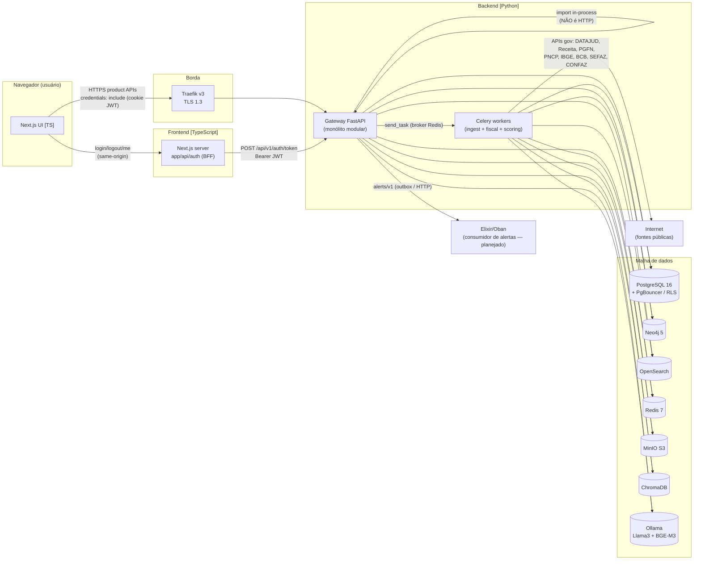

**Mecanismos de comunicação identificados:**

1. **Browser → Gateway (HTTP/REST direto)** — as chamadas de produto (`lib/api/*`) vão direto ao gateway
   com `credentials:'include'` (cookie `jwt` httpOnly). Erros seguem **RFC 9457 `application/problem+json`**.
2. **Browser → Next.js (BFF same-origin)** — apenas `login`/`logout`/`me` passam por *route handlers*
   Next (`app/api/auth/*`) que fazem proxy ao gateway e gerenciam o cookie httpOnly (mantém o JWT fora do JS).
3. **Gateway → serviços de produto (in-process import)** — **não há HTTP interno**; os routers importam os
   pacotes de domínio Python diretamente. É um **monólito modular**, não microserviços de rede.
4. **Gateway/serviços → workers (Celery via broker Redis)** — trabalhos assíncronos: `scoring.tasks.run_batch_score`,
   `fiscal.tasks.enrich_spreadsheet`, e todos os coletores de ingestão.
5. **Persistência poliglota** — Postgres (RLS por tenant), Neo4j (grafo de litigância), OpenSearch (busca full-text
   silver), Redis (cache/idempotência/rate-limit/broker), MinIO (bronze JSONL + traces de modelo), ChromaDB+Ollama (RAG).
6. **Seam Python↔Rust** (`ScoreEngine` via PyO3) e **seam Python↔Elixir** (`AlertPublisher` / `alerts/v1`) —
   fronteiras de linguagem por contrato serializável.

### 1.3. Dependências externas por linguagem (dos arquivos de gerência de pacotes)

**Python** (`pyproject.toml`, `services/*/requirements.txt`, CI): `fastapi`, `uvicorn`, `pydantic 2.9.2`,
`sqlalchemy`, `psycopg2-binary`, `PyJWT` (RS256), `cryptography`, `redis`, `celery` + `django_celery_beat`,
`scikit-learn` (IsolationForest/KMeans), `pymc` + `arviz` (Bayesiano), `rapidfuzz` (NCM fuzzy),
`openpyxl` (planilhas), `playwright` (scraping SEFAZ), `pdfplumber`/`pymupdf`/`pytesseract` (OCR CONFAZ),
`neo4j`, `opensearch-py`, `minio`, `chromadb`, `prometheus-fastapi-instrumentator`, `opentelemetry-*`. Lint `ruff`.

**TypeScript** (`frontend/**/package.json`): `next@14.2.18`, `react@18.3`, `@tanstack/react-query@5.62`,
`recharts`, `lucide-react`, `clsx`, `tailwind-merge`; design system `@juridico/ui` + `@juridico/tokens`
(via `workspace:*`); testes `vitest` + `@testing-library`. Gerência: `pnpm@9.12.3` + `turbo`.

**Infra:** Postgres 16, PgBouncer 1.20, Neo4j 5, OpenSearch 2.12, Redis 7, MinIO, ChromaDB, Ollama,
Traefik v3, Prometheus/Grafana/Loki/Promtail/Alertmanager, Flower.

---

## 2. Passo 2 — Resultado da análise estática (inventário condensado)

Contagem de entidades relevantes extraídas (nomes exatos preservados nos diagramas):

| Camada | Principais entidades | Arquivo(s) de origem |
|---|---|---|
| **Contratos/DTO (Python)** | `ScoreRequest`, `ScoreResult`, `RiskLevel`, `ScoreEngine`(Protocol); `NcmTriageRequest/Result`, `IcmsResolution`, `UF`, `FonteRegra`; `AlertEnvelope`, `AlertPublisher`(Protocol); `TaxPredictRequest/Response`; `PetiRequest/Section/Response`, `TipoAcao`; `ConciliaRequest/Fator/Response`; `DefensorRequest/Response`, `EventoAgente`, `Canal`; `ProtocoloRequest/Resultado` | `services/shared/contracts/*.py` |
| **Gateway** | `app`(FastAPI), `JWTAuthMiddleware`, `RateLimitMiddleware`, `SecurityHeadersMiddleware`; 20 `APIRouter`; `AuthenticatedUser` | `services/gateway/**` |
| **Segurança/LGPD** | `DecisionLedger`, `PostgresDecisionLedger`; `hash_user_id`, `pseudonymize_process_record`; `encrypt_for_ledger`/`erase_titular` (crypto-shredding); `tenant_transaction` | `services/shared/{ledger,lgpd,lgpd_crypto,tenant_db}` |
| **Scoring** | `PythonScoreEngine`, `RustScoreEngine`, `_FallbackEngine`, `get_score_engine`; `FeatureVector`, `assemble_features`; `ModelMetrics` | `services/scoring/**` |
| **Fiscal** | `classify`, `match_exact/fuzzy`, `resolve_icms`, `RagNcmSource`; `DbNcmSource/IcmsSource/CategorySource`; `build_batch_anchor`; tasks `enrich_spreadsheet`/`classify_chunk`/`finalize_enrichment` | `services/fiscal/**` |
| **Ingest** | `CircuitBreaker`, `persist_silver`, `add_linage`; `*Bronze`/`*Silver` (12 fontes); coletores Celery | `services/ingest/**` |
| **ContabilIA** | `CrossCheckEngine`, `CrossCheckFinding`, `analyze_benford`, `compute_zscore`, `AnomalyDetector` | `services/audit/**` |
| **Defensor (agente)** | `run_agente`, `ProtocoloDriver`(ABC), `SimulacaoDriver`, `ConsumidorGovDriver`, `ProconSPDriver`, `get_driver` | `services/defensor/**` |
| **IA/RAG** | `RAGEngine`, `generate_text`, `LLMRouter`, `LLMMemoizer` | `services/shared/ai/**` |
| **Frontend — design system** | tokens (`RiskLevel`, `FreshnessBand`, `scoreToriskLevel`…); primitives (`Button`, `Card`, `Table`…); patterns (`ScoreGauge`, `MerklePanel`, `TrustHeader`, `AgentLiveFeed`, `ProblemJsonError`, `RbacGate`…) | `frontend/packages/**` |
| **Frontend — app** | `ApiError`, `api` (client); módulos `legalscoreApi`, `contabiliaApi`…; `ShellProvider`/`useShell`; route handlers auth | `frontend/apps/platform/**` |

---

## 3. Passo 3 — Padrões arquiteturais detectados

| Padrão | Onde aparece | Observação |
|---|---|---|
| **API Gateway / Facade** | `services/gateway` | Um único FastAPI agrega 20 routers; roteia para pacotes de domínio por import. |
| **Monólito modular** | gateway ↔ serviços | Fronteiras lógicas fortes (contratos), mas deploy único; sem HTTP interno. |
| **Anti-Corruption Layer / Seam por `Protocol`** | `ScoreEngine`, `AlertPublisher`, `NcmSource`/`IcmsSource`, `RuleParser`, `SemanticNcmSource` | `Protocol`s estruturais serializáveis — pontos de troca de implementação (Rust, Elixir, DB, LLM). |
| **Strategy + Factory + Fallback (decorator)** | `get_score_engine`→`_FallbackEngine`; `get_driver`→drivers de protocolo; `get_alert_publisher` | Seleção por configuração + degradação graciosa. |
| **Repository / DAO** | `AuthenticatedUser`+`authenticate`; `DbNcmSource`; `queries.py` de vários serviços | Isola SQL/Cypher do núcleo puro. |
| **Medalhão (bronze→silver→gold)** | `services/ingest/pipeline` | `persist_silver` como sink DRY de 3 lojas. |
| **Circuit Breaker** | `services/ingest/pipeline/base.py` | Por fonte externa; CLOSED/OPEN/HALF_OPEN. |
| **Transactional Outbox** | `OutboxAlertPublisher` + `alerts_outbox` | Entrega de alertas idempotente (consumida por Elixir/Oban). |
| **Núcleo puro + casca de I/O** | quase todos os serviços | `engine.py`/`forecast.py`/`detect.py` puros; `queries.py`/`tasks.py` com I/O. |
| **Decision Ledger (Merkle + crypto-shredding)** | `ledger/merkle.py` + `lgpd_crypto.py` | Trilha auditável imutável; PII apagável sem quebrar a prova. |
| **BFF (Backend-for-Frontend)** | `frontend/app/api/auth/*` | Proxy same-origin que guarda o JWT em cookie httpOnly. |
| **Design System em camadas** | `tokens → ui/primitives → ui/patterns → app` | Tipos-união canônicos em `@juridico/tokens`. |
| **CQRS-lite / feature store** | `jurimetria.indicador` (gold) lido por forecasting/chamber/early_warning | Escrita por agregação Celery; leitura por vários produtos. |

---

## 4. Diagrama de Casos de Uso

**Objetivo:** mostrar quem usa o sistema e as funcionalidades de negócio principais, com relações `«include»`/`«extend»`.

**Escopo:** atores humanos e sistemas externos; os 9 produtos + funções transversais (auth, auditoria/ledger, alertas).

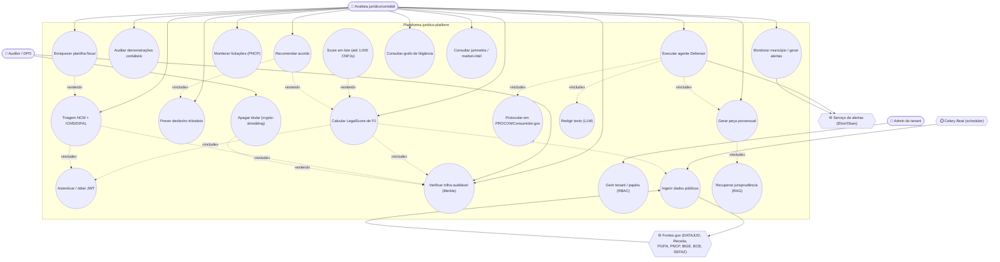

**Legenda:** `(( ))` = caso de uso; `([ ])` = ator humano; `{{ }}` = ator/sistema externo; setas cheias = associação
ator↔caso; setas tracejadas rotuladas `«include»`/`«extend»` = dependências entre casos.

**Notas de design:**
- **`«include» UC_login`** reflete o `JWTAuthMiddleware`: todo caso (exceto rotas públicas) exige JWT válido.
- **`«include» UC_ledger`** só aparece nos produtos que gravam Decision Ledger (LegalScore, Fiscal, jurimetria,
  second-opinion, settlement-optimizer) — os demais são consultas puras.
- **DanoBot** foi omitido: seu endpoint responde `501` (bloqueado pelo DPO, PD-06, por depender de dados sensíveis
  de saúde do DATASUS). É um caso de uso **planejado, não habilitado** — vale registrar no backlog de conformidade.
- `UC_protocolar` só efetiva submissão real quando `PROTOCOLO_MODO=real` + credenciais; senão é **simulação**.

---

## 5. Diagrama de Pacotes

**Objetivo:** organização lógica do código e dependências direcionadas entre pacotes Python e módulos TypeScript.

**Escopo:** pacotes de backend (`services/*`), o núcleo transversal (`services/shared/*`) e os pacotes do frontend.

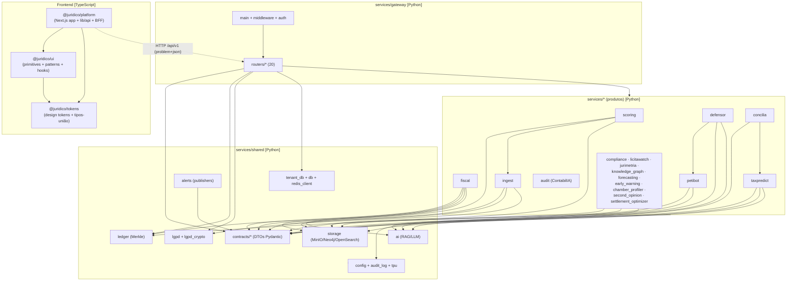

**Legenda:** caixa = pacote; seta cheia = dependência de compilação/import (`import`); seta tracejada rotulada =
dependência de runtime por rede (HTTP). `contracts` é o **hub de tipos** — quase tudo depende dele, nada depende de ninguém a partir dele (dependência estável, alinhada ao *Stable Dependencies Principle*).

**Notas de design:**
- **`services/shared/contracts` é o núcleo estável** — imutável, `frozen`, `extra=forbid`. Excelente coesão de
  contrato. Ponto de atenção: há **acoplamento entre contratos** (`concilia` importa `TipoAcao` de `petibot`;
  `defensor` importa `PetiSection` de `petibot`; `protocolo` importa `Canal` de `defensor`). Cadeias assim
  dificultam versionar um contrato isoladamente — considerar um pacote `contracts/common` para enums compartilhados.
- **Placeholders vazios** que a estrutura sugere existir mas não têm código: `services/ai-engine`,
  `services/shared/{consensus,http_client,vector_store,db(pacote)}`. A funcionalidade implícita vive noutro lugar
  (RAG em `ai/rag`, consenso em `second_opinion`/`concilia`). Vale **remover ou preencher** para evitar confusão.
- **`scoring` importa `ingest`** (`scoring/features.py` → `ingest.pipeline.quality`): um produto depende do pipeline
  de dados. É pragmático, mas cria acoplamento produto→ingest; um pacote `shared/enrichment` reduziria isso.

---

## 6. Diagrama de Componentes

**Objetivo:** mapear componentes de software executáveis, suas interfaces de comunicação e as **fronteiras de linguagem** (seams).

**Escopo:** frontend, gateway, workers, seams Rust/Elixir e a malha de dados/IA.

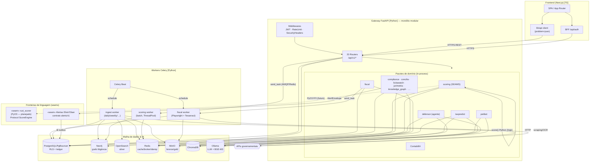

**Legenda:** retângulo = componente; cilindro = data store; `{{ }}` = sistema externo; `«seam»` = fronteira de
linguagem por contrato; seta cheia = chamada síncrona/import; seta tracejada = chamada por FFI/rede planejada;
rótulos de aresta = protocolo/interface.

**Notas de design:**
- **O gateway é um monólito modular**, não uma malha de microserviços. Vantagem: latência baixa (sem hop HTTP
  interno), transações simples. Custo: **não é possível escalar/deployar produtos independentemente** — todos sobem
  no mesmo processo `gateway`. Se um produto (ex.: taxpredict com PyMC) exigir isolamento de recursos, será preciso
  extrair para um serviço de rede — os `Protocol`s de contrato já facilitam esse recorte.
- **Dois seams de linguagem** bem desenhados: `ScoreEngine` (Rust/PyO3) e `AlertPublisher`/`alerts/v1` (Elixir).
  Ambos passam apenas dados serializáveis imutáveis — pré-requisito para cruzar FFI/rede com segurança.
- **Workers fiscais são "gordos"** (Chromium + Tesseract na imagem) e rodam em fila própria (`fiscal`, `fiscal_ingest`),
  separados do ingest geral — bom isolamento de dependências pesadas.
- **Ponto de atenção (segurança):** `compose/fiscal.yml` usa `juridico-net` como `external: true` e **não** é incluído
  pelo `docker-compose.yml` raiz — o worker fiscal precisa ser subido separadamente. Documentar ou consolidar.

---

## 7. Diagrama de Classes — Parte A: Contratos & Seams (fronteira de tipos)

**Objetivo:** o coração do sistema — os DTOs versionados e os `Protocol`s que definem as fronteiras (inclusive Rust/Elixir).

**Escopo:** `services/shared/contracts/*` + os *engines* que satisfazem os Protocols.

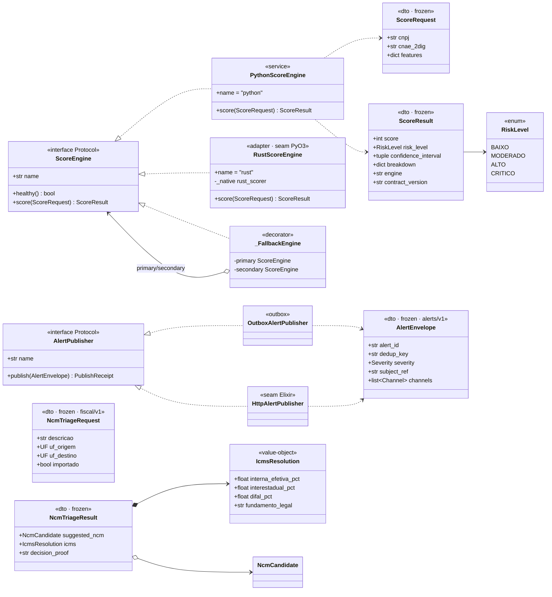

**Legenda:** `«interface Protocol»` = `typing.Protocol` estrutural (não requer herança nominal); `«dto·frozen»` =
Pydantic imutável (`ConfigDict(frozen=True, extra="forbid")`); `<|..` = realização/implementação; `o-->` = agregação;
`*-->` = composição; `..>` = dependência (uso). Anotações `alerts/v1`/`fiscal/v1` = `contract_version`.

**Notas de design:**
- **`ScoreEngine` é o exemplo canônico de seam**: um `Protocol` estrutural + `runtime_checkable`. Um crate Rust não
  precisa importar Python — basta expor `name`, `healthy()`, `score()`. O campo `engine` no `ScoreResult` torna
  **auditável qual implementação** produziu o resultado (gravado no Decision Ledger). Excelente para migração segura.
- **`_FallbackEngine` (decorator)** encapsula a resiliência: tenta o primário, cai para o secundário em
  `ScoringUnavailable`. Bem desenhado — mas a nota no código alerta que um *segfault* real do Rust derruba o processo;
  o fallback cobre erro recuperável, não *panic* nativo (exige supervisor + health check).
- **Determinismo por contrato**: `NcmTriageRequest`→`classify`→`NcmTriageResult` é puro; a ancoragem no Ledger é etapa
  separada — separação limpa de "cálculo" vs. "auditoria".

---

## 8. Diagrama de Classes — Parte B: Auditoria, LGPD & Isolamento de Tenant

**Objetivo:** o subsistema de conformidade — Decision Ledger (Merkle), crypto-shredding e RLS por tenant.

**Escopo:** `services/shared/{ledger,lgpd,lgpd_crypto,tenant_db,audit_log}`.

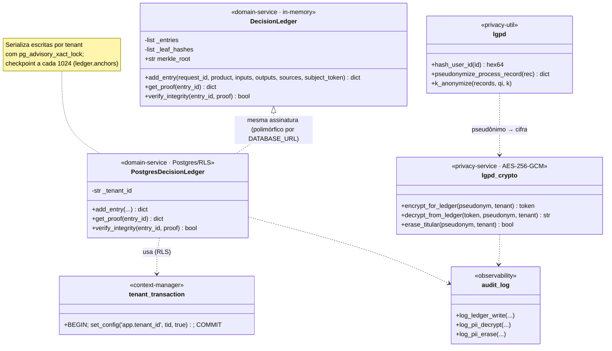

**Legenda:** `<|..` aqui indica **polimorfismo estrutural** (ambos os ledgers têm a mesma interface; o router escolhe a
implementação em runtime conforme `DATABASE_URL`). `note` = anotação de comportamento. `«...»` = estereótipo de camada.

**Notas de design:**
- **Crypto-shredding** é a decisão de conformidade mais elegante: o `subject_token` no ledger é PII cifrada
  (AES-256-GCM por titular+tenant). Apagar a chave (`erase_titular`) torna a PII irrecuperável **sem quebrar a prova
  de integridade Merkle** — resolve o conflito entre "trilha imutável" e "direito ao esquecimento (LGPD)".
- **Isolamento de tenant** depende de 3 camadas que precisam funcionar juntas: `SET LOCAL app.tenant_id` (via
  `set_config(..., is_local=true)`), pool `transaction` do PgBouncer, e RLS `FORCE` no Postgres com a app conectando
  como `app_user` (não-superusuário). O CI tem um job dedicado provando isso (`integration-tests`).
- **Ponto de atenção (escala):** `PostgresDecisionLedger.add_entry` é **O(N)** por inserção (relê todos os `leaf_hashes`
  do tenant para recomputar a raiz). Documentado como dívida técnica (QT-08): migrar para MMR (Merkle Mountain Range)
  para O(log N). O `advisory_xact_lock` serializa escritas por tenant — throughput de escrita limitado por tenant.

---

## 9. Diagrama de Classes — Parte C: Scoring (SEAMS) & Enriquecimento de Features

**Objetivo:** detalhar a montagem de features (a partir das lojas de ingestão) e o cálculo do score.

**Escopo:** `services/scoring/*`.

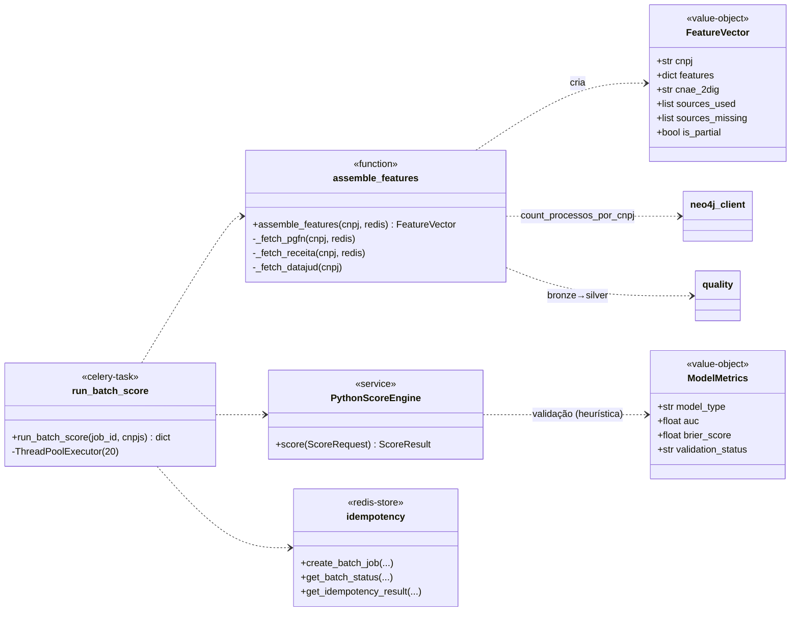

**Legenda:** `«function»` = módulo de funções puras; `«celery-task»` = tarefa assíncrona; `«redis-store»` = estado em Redis.

**Notas de design:**
- **Degradação parcial explícita:** se uma fonte (PGFN/Receita/DATAJUD) está ausente no cache, a feature recebe `0.0`
  e `is_partial=True`, com `sources_missing` propagado ao *disclaimer* da resposta. O usuário sabe que o score é parcial.
- **Batch usa `ThreadPoolExecutor(20)`**, não Celery-fan-out, porque as tarefas são I/O-bound (gets no Redis) — pragmático
  para o SLA de 1k CNPJs < 30s. Contrasta com o fiscal, que usa *chord* Celery (CPU/IO distribuído entre réplicas).
- **Score é rotulado "heurística"** (`ModelMetrics.validation_status = "pending"`, sem AUC/Brier) — honestidade de produto;
  a validação formal é Fase 1d. Bom para conformidade (não vende como preditivo validado).

---

## 10. Diagrama de Classes — Parte D: Defensor (camada agêntica) & Drivers de Protocolo

**Objetivo:** o serviço mais rico — orquestração agêntica + Strategy/Factory de drivers de protocolo (com scaffolding Playwright).

**Escopo:** `services/defensor/*` + contratos `defensor`/`protocolo`.

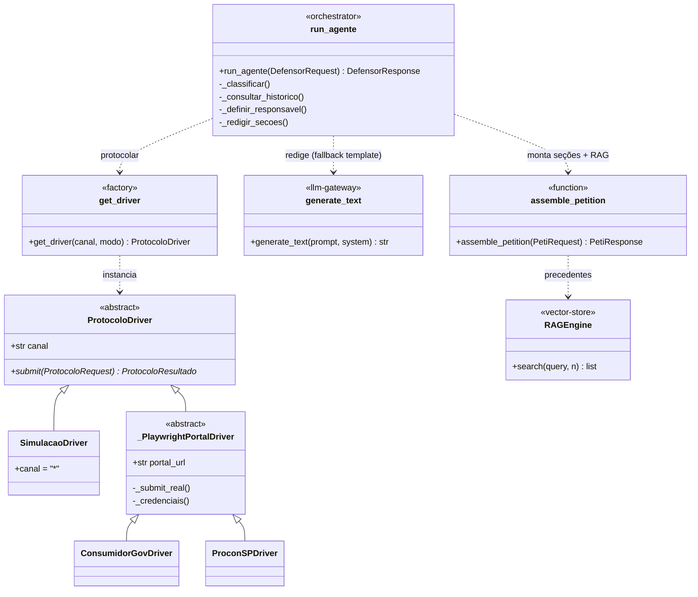

**Legenda:** `<|--` = herança (generalização); `«abstract»` = ABC (`ProtocoloDriver` tem `@abstractmethod submit`);
`«orchestrator»` = coordena o pipeline; `«llm-gateway»`/`«vector-store»` = camada de IA compartilhada.

**Notas de design:**
- **Strategy + Factory + Template Method**: `ProtocoloDriver` (ABC) → `SimulacaoDriver` (default seguro) e
  `_PlaywrightPortalDriver` (Template Method: `submit` gera nº simulado, `_submit_real` é o gancho). `get_driver`
  devolve `SimulacaoDriver` a menos que `modo="real"` **e** exista driver real — *fail-safe* por padrão.
- **Degradação em cascata no `_redigir_secoes`**: cada seção tenta LLM; a primeira falha de LLM comuta todo o resto
  para template (`via ∈ {llm, parcial, template}`), com proveniência registrada por seção. Ótimo para transparência
  ("isto foi gerado por IA / parcial / template").
- **`_submit_real` ainda é scaffolding** (`NotImplementedError`→status `FALHA`). O agente é production-ready para
  simulação/handoff; a submissão real em portais é trabalho futuro gated por credenciais.
- **Regra de handoff humano**: `Canal.CONTENCIOSO` ou `valor ≥ R$ 50.000` → responsável humano. Boa fronteira
  agente↔humano codificada como política.

---

## 11. Diagrama de Classes — Parte E: ContabilIA (cross-checks) & Ingest (medalhão)

**Objetivo:** o motor de auditoria contábil e a infraestrutura de pipeline com circuit breaker.

**Escopo:** `services/audit/*` + `services/ingest/pipeline/*`.

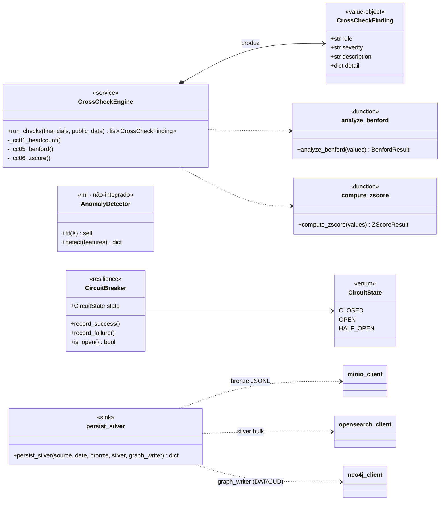

**Legenda:** `list~CrossCheckFinding~` = retorno tipado; `«ml·não-integrado»` = componente disponível mas ainda não
plugado num router; `«sink»` = escritor DRY multi-loja.

**Notas de design:**
- **8 cross-checks (CC01–CC08)** cruzam a DRE enviada com dados públicos (CAGED, SICONFI, PNCP) + testes estatísticos
  (Benford CC05, Z-score CC06, liquidez CC07, EBITDA CC08). Hoje `public_data={}` no router, então CC01–CC04 são pulados —
  a integração com o feature store público é o próximo passo.
- **`AnomalyDetector` (IsolationForest + KMeans)** existe e é treinável, mas **não está plugado** em nenhum router —
  componente órfão. Decidir: integrar (CC estatístico ML) ou remover.
- **`persist_silver` é um bom ponto DRY**: um único sink escreve nas 3 lojas (MinIO/OpenSearch/Neo4j) com isolamento
  de falha por loja. `CircuitBreaker` por fonte evita martelar APIs governamentais instáveis.

---

## 12. Diagrama de Classes — Parte F: Frontend (Design System + Camada de API)

**Objetivo:** as camadas do frontend TypeScript e como os tipos espelham os contratos Python.

**Escopo:** `frontend/packages/*` + `frontend/apps/platform/lib/api/*` + contexto.

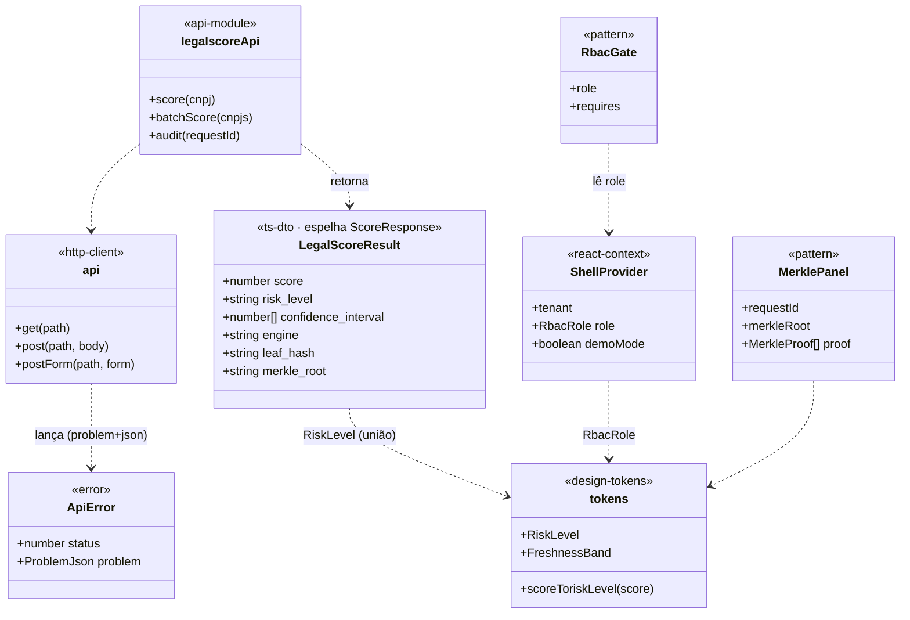

**Legenda:** `«ts-dto·espelha X»` = interface TypeScript **escrita à mão** que espelha um contrato Pydantic (não há
code-gen — sincronização manual via `contract_version`); `«pattern»`/`«design-tokens»` = camadas do design system.

**Notas de design:**
- **Espelhamento de contrato sem code-gen**: `LegalScoreResult` (TS) reflete `ScoreResponse` (Python), inclusive o campo
  `engine: 'python' | 'rust'` — a fronteira Rust "vaza" até o tipo do frontend. É o **contrato cross-linguagem mais
  visível** do sistema. Risco: *drift* silencioso; mitigado por `contract_version` e testes de contrato no CI, mas um
  gerador (openapi-typescript a partir do `/openapi.json` do gateway) eliminaria a duplicação manual.
- **Camadas do design system** (`tokens → primitives → patterns → app`) são limpas e unidirecionais. **Ponto de atenção:**
  os valores de cor/fonte estão **duplicados** entre `packages/tokens/tailwind.preset.ts` e
  `apps/platform/tailwind.config.ts` (a app não importa o preset) — risco de *drift* visual.
- **Dois eixos globais de estado** (`demoMode` e `role` no `ShellProvider`) governam quase toda página — central para
  entender a UI: cada página escolhe entre view-model mock (demo) e query real (gateway), e gateia ações por RBAC.

---

## 13. Diagrama de Sequência — Fluxo 1: Autenticação (login → JWT → cookie)

**Objetivo:** o fluxo BFF de autenticação e emissão do JWT RS256.

**Escopo:** página de login (TS) → route handler Next (BFF) → gateway `auth` → Postgres.

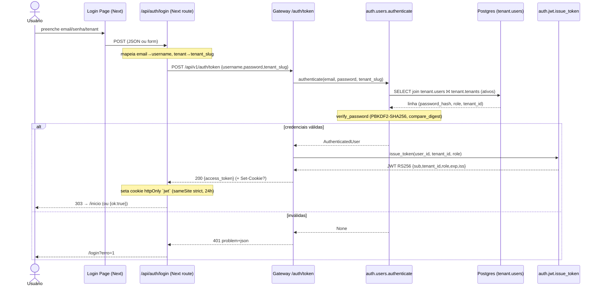

**Legenda:** `alt/else` = fluxo alternativo; `Note` = nota de processamento; `-->>` = retorno; `->>` = chamada síncrona.

**Notas de design:**
- **BFF mantém o JWT fora do JavaScript** (cookie httpOnly) — mitiga XSS. As chamadas de produto reusam esse cookie
  via `credentials:'include'`.
- **Falha de banco → 503** (produção) via `AuthBackendError`, distinguindo "infra fora" de "credenciais inválidas (401)".
  Em dev/test há usuário-fallback e chaves RS256 efêmeras (o gateway **falha fechado** em produção se as chaves faltarem).
- **`tenant.users`/`tenant.tenants` NÃO estão sob RLS** (é o ponto de entrada pré-tenant) — usam engine não-tenant.

---

## 14. Diagrama de Sequência — Fluxo 2: LegalScore (endpoint de referência P2)

**Objetivo:** o fluxo canônico com idempotência, feature assembly, engine SEAMS e Decision Ledger.

**Escopo:** gateway `legalscore` → scoring → Redis/Neo4j → ledger.

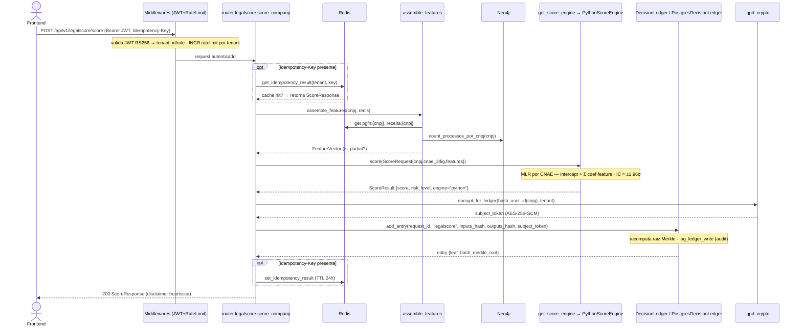

**Legenda:** `opt` = trecho opcional; `Note over` = processamento interno.

**Notas de design:**
- **Este router é o template P2** replicado pelos demais: JWT + rate-limit + idempotência + problem+json + OTel span +
  Decision Ledger. Alta consistência arquitetural.
- **PII nunca entra no ledger em claro**: só `inputs_hash`/`outputs_hash` (SHA-256) + `subject_token` (AES-GCM). O CNPJ é
  parcialmente mascarado em spans/logs (`cnpj[:6]+"****"`).
- **Escolha de ledger em runtime**: `PostgresDecisionLedger(tenant)` se `DATABASE_URL` setado; senão singleton em memória
  (dev/test). Mesma interface — polimorfismo estrutural.

---

## 15. Diagrama de Sequência — Fluxo 3: Enriquecimento de planilha fiscal (chord Celery + Merkle de lote)

**Objetivo:** o fluxo assíncrono mais elaborado — upload → fan-out → ancoragem Merkle de lote → persistência RLS.

**Escopo:** gateway `fiscal` → MinIO → chord Celery (`classify_chunk` × N → `finalize_enrichment`) → ledger + Postgres.

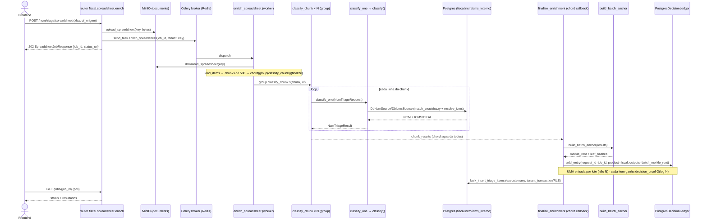

**Legenda:** `loop` = iteração; `group`/`chord` = primitivas Celery (fan-out + barreira de junção).

**Notas de design:**
- **Fan-out horizontal real** (chord entre réplicas do `fiscal-worker`), diferente do batch de scoring (threads). Preserva
  `SET LOCAL app.tenant_id` porque cada task roda em sua própria transação — RLS intacto.
- **Ancoragem Merkle de lote**: **1 entrada de Ledger por job** (não por item), com raiz do lote; cada item recebe uma
  **prova de inclusão O(log N)** (`decision_proof`). Evita o custo O(N²) de N inserções no ledger append-only.
- **Só a *chave* MinIO trafega pelo broker** (não os bytes) — evita payloads gigantes no Redis.

---

## 16. Diagrama de Sequência — Fluxo 4: Ingestão DATAJUD (medalhão + LGPD)

**Objetivo:** o pipeline de ingestão mais completo (bronze→silver→grafo) com circuit breaker e pseudonimização.

**Escopo:** Celery Beat → `datajud.run_daily_ingest` → 3 lojas.

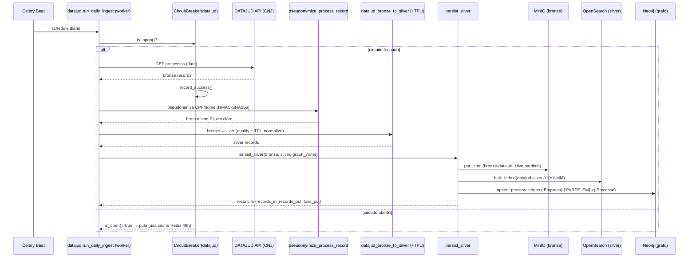

**Legenda:** `alt` sobre estado do circuit breaker.

**Notas de design:**
- **LGPD by design**: a pseudonimização (HMAC) ocorre **antes** de qualquer persistência; nenhuma das 3 lojas recebe PII
  em claro. O grafo Neo4j alimentado aqui é o que o LegalScore lê em `count_processos_por_cnpj`.
- **`reconcile`** mede perda entre entrada e saída (contrato de qualidade), registrada em `ingest.runs`.
- **Circuit breaker por fonte** com fallback a cache Redis de 48h — resiliência a instabilidade das APIs governamentais.

---

## 17. Diagrama de Sequência — Fluxo 5: Defensor agêntico + enriquecimento cross-service (Concilia)

**Objetivo:** ilustrar orquestração agêntica (RAG+LLM) e chamadas cross-service in-process com degradação.

**Escopo:** `defensor.run` (RAG+LLM) e, à parte, `concilia.recommend` consumindo taxpredict+legalscore.

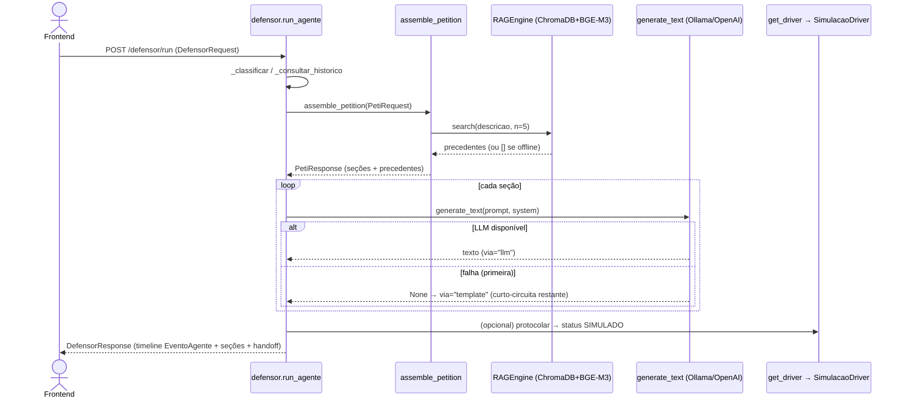

**Legenda:** `loop`+`alt` mostram a degradação por seção; retorno `None` do LLM comuta para template.

**Notas de design:**
- **Chamadas cross-service são in-process e graceful-degrade**: `concilia.recommend` importa o modelo taxpredict e lê
  `score:{cnpj}` do Redis; se qualquer um falha, segue com `None` e ajusta a recomendação — nunca 500.
- **Proveniência por seção** (`llm`/`parcial`/`template`) é exposta ao usuário (`ProvenanceTag` no frontend) — anti-alucinação.

---

## 18. Diagrama de Atividades — Fluxo 1: Seleção de engine de scoring com fallback (seam Rust)

**Objetivo:** o algoritmo de seleção/degradação do `factory` — o coração do seam Python↔Rust.

**Escopo:** `services/scoring/engine/factory.py` + runtime de `_FallbackEngine`.

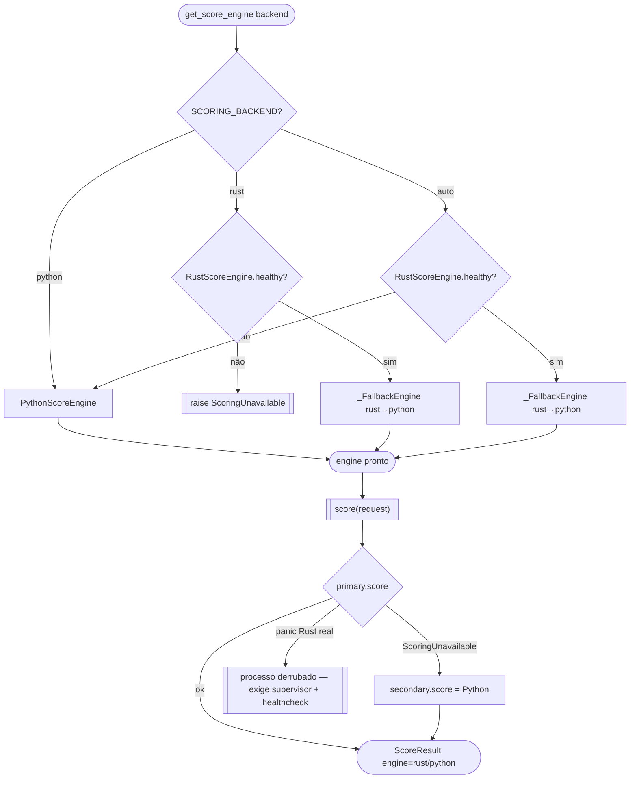

**Legenda:** `([ ])` = início/fim; `{ }` = decisão; `[[ ]]` = ação especial/exceção; `[ ]` = ação.

**Notas de design:**
- **Troca Python→Rust é configuração, não código** — nenhum chamador muda. O `_FallbackEngine` protege erros
  *recuperáveis* em runtime, mas um *segfault* nativo é fora do alcance do try/except (ramo `panic Rust real`): exige a
  outra camada de defesa (supervisor que reinicia o worker + health check antes de aceitar tráfego).
- **Equivalência comportamental** entre engines é garantida pela suíte `test_score_engine_contract.py` (determinismo,
  faixa 0–1000, coerência do IC) — pré-requisito para a migração ser segura.

---

## 19. Diagrama de Atividades — Fluxo 2: Triagem NCM + resolução ICMS/DIFAL (determinística)

**Objetivo:** a lógica de decisão fiscal (com fundamentos legais embutidos).

**Escopo:** `services/fiscal/triage/{engine,ncm_matcher,icms_resolver}.py`.

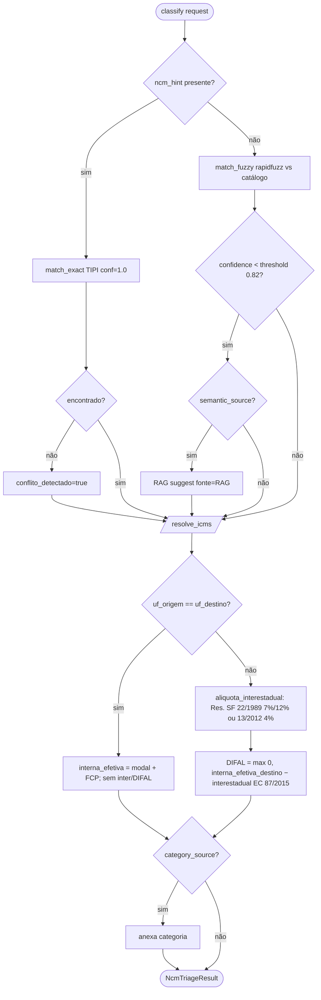

**Legenda:** `[/ /]` = subprocesso; ramos rotulados = condições de negócio com base legal citada.

**Notas de design:**
- **100% determinístico** (auditabilidade > sofisticação): dado o mesmo input e a mesma base vigente, a saída é idêntica.
  `classify()` é puro (não toca o Ledger) — a ancoragem é etapa separada.
- **Fundamentos legais embutidos no código** (Res. SF 22/1989 e 13/2012, EC 87/2015, LC 190/2022) e propagados em
  `fundamento_legal` — rastreabilidade jurídica na própria resposta.
- **Escalonamento de confiança** TIPI(1.0) → FUZZY(0.82) → RAG — bom design de *fallback* de classificação.

---

## 20. Diagrama de Implantação (Deployment)

**Objetivo:** a topologia de execução Docker Compose — nós, containers, redes, volumes e protocolos.

**Escopo:** todos os fragmentos de `docker/compose/*` (mesclados via `include`) + o worker fiscal standalone.

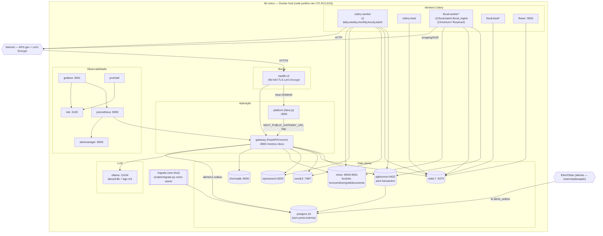

**Legenda:** `subgraph` = agrupamento lógico de nós; cilindro = data store; `[[ ]]` = container efêmero (one-shot);
`{{ }}` = sistema externo; `*` = o `fiscal-worker`/`fiscal-beat` vivem em `docker/compose/fiscal.yml` **não incluído** no
compose raiz (rede `external`), subidos à parte.

**Notas de design:**
- **Nó único, sem portas de banco expostas** — Postgres/Neo4j/OpenSearch/Redis/Chroma não publicam porta no host
  (acesso só interno/túnel SSH). Bom hardening; um job de CI (`docker-security`) verifica que `base.yml` não expõe DB.
- **PgBouncer em `pool_mode=transaction`** é pré-requisito do isolamento RLS via `SET LOCAL` — a topologia sustenta a
  decisão de segurança do código.
- **Segredos via Docker Secrets** (`/run/secrets/*`, `load_secret()`), preferidos a variáveis de ambiente.
- **Lacunas vs. README:** o README cita Redis **Sentinel** e Neo4j **Enterprise**, mas o compose entrega Redis single +
  Neo4j **Community**. `postgres-exporter`/`redis-exporter`/`node-exporter` são alvos de scrape do Prometheus mas **não
  há containers** definidos para eles. `infra/terraform` é apenas placeholder (o backup real está no Makefile). Kubernetes/Helm
  é roadmap (Fase 4), não presente. Registrar como gaps de infraestrutura.

---

## 21. Análise crítica — coesão, acoplamento e oportunidades de refatoramento

### 21.1. Pontos fortes (alta coesão, bom desacoplamento)

1. **Fronteira de tipos estável e explícita** (`services/shared/contracts`): DTOs imutáveis, versionados, `extra=forbid`.
   Os `Protocol`s (`ScoreEngine`, `AlertPublisher`, `NcmSource`, `RuleParser`) são *seams* de primeira classe — o sistema
   foi desenhado para trocar implementações (Rust, Elixir, DB, LLM) sem tocar chamadores.
2. **Núcleo puro + casca de I/O** repetido em quase todo serviço (`engine.py`/`detect.py`/`forecast.py` puros;
   `queries.py`/`tasks.py` com I/O). Facilita testes unitários determinísticos (o CI exige cobertura ≥ 80%).
3. **Conformidade projetada, não remendada**: Decision Ledger (Merkle) + crypto-shredding + RLS + audit_log formam um
   subsistema coeso que resolve o trade-off "imutabilidade × LGPD".
4. **Consistência de API**: o router LegalScore é um template P2 fielmente replicado (problem+json, idempotência, OTel,
   rate-limit por tenant).

### 21.2. Acoplamentos e riscos (oportunidades de refatoramento)

| # | Observação | Impacto | Sugestão |
|---|---|---|---|
| R1 | **Monólito modular**: todos os produtos no mesmo processo `gateway`. | Não escala/deploya por produto; um produto pesado (PyMC) afeta todos. | Extrair produtos de recurso-intensivo para serviços de rede reusando os `Protocol`s já existentes. |
| R2 | **Espelhamento manual de DTOs Python↔TS** (sem code-gen). | *Drift* silencioso entre backend e frontend. | Gerar tipos TS a partir do `/openapi.json` do gateway (openapi-typescript) no CI. |
| R3 | **Cadeia de imports entre contratos** (`concilia`→`petibot`, `protocolo`→`defensor`). | Dificulta versionar um contrato isoladamente. | Extrair enums compartilhados (`TipoAcao`, `Canal`, `PetiSection`) para `contracts/common`. |
| R4 | **Ledger O(N) por inserção** + advisory lock por tenant. | Throughput de escrita limitado por tenant; custo cresce com o histórico. | Migrar para MMR (Merkle Mountain Range) — já rastreado como QT-08. |
| R5 | **Pacotes placeholder vazios** (`ai-engine`, `shared/{consensus,http_client,vector_store,db}`). | Confundem o leitor sobre onde vive a lógica. | Remover ou preencher; documentar que RAG está em `ai/rag`, consenso em `second_opinion`. |
| R6 | **Componentes órfãos** (`AnomalyDetector`, `LLMRouter`, `LLMMemoizer` não plugados). | Código morto aparente / intenção ambígua. | Integrar num router ou marcar explicitamente como experimental. |
| R7 | **Duplicação de tokens Tailwind** (preset vs. `apps/platform/tailwind.config.ts`). | *Drift* visual entre design system e app. | App deve importar `@juridico/tokens/tailwind` em vez de reinlinar. |
| R8 | **`scoring` importa `ingest`** (produto→pipeline). | Acoplamento produto↔ingest. | Extrair enriquecimento para `shared/enrichment`. |
| R9 | **`compose/fiscal.yml` fora do include raiz** (rede `external`). | Worker fiscal esquecido em `make up`. | Consolidar no compose principal ou documentar o passo extra. |
| R10 | **Gaps README × compose** (Sentinel/Enterprise/exporters/terraform). | Expectativa de operação divergente do entregue. | Alinhar README ao estado real ou fechar os gaps de infra. |

### 21.3. Métricas qualitativas de acoplamento

- **`services/shared/contracts`** — *fan-in* altíssimo, *fan-out* ~zero → **dependência estável** (correto para um núcleo de contratos).
- **`gateway/routers`** — *fan-out* alto (dependem de todos os produtos), *fan-in* só do `main` → camada de fronteira fina (correto).
- **`services/shared/ai`** — reusado por petibot/defensor/fiscal/taxpredict → bom candidato a serviço isolado se a carga LLM crescer.

---

## 22. Observações específicas por linguagem

| Linguagem | Achados relevantes para a arquitetura |
|---|---|
| **Python** | `@dataclass(frozen=True)` (DTOs/value-objects como `AuthenticatedUser`, `FeatureVector`, `CrossCheckFinding`); Pydantic v2 `ConfigDict(frozen=True, extra="forbid")` nos contratos; `typing.Protocol` + `@runtime_checkable` como *seams* estruturais (o ponto arquitetural central); `@abstractmethod` em `ProtocoloDriver`; `StrEnum` onipresente (RiskLevel, UF, Canal…); decorators Celery `@app.task`; `@asynccontextmanager` (lifespan) e `@contextmanager` (`tenant_transaction`, `span`); imports dinâmicos/lazy para degradação graciosa (OTel, Redis, engines nativos). |
| **Rust** | **Não há código Rust.** Presente apenas como *seam* planejado: `RustScoreEngine` (adapter PyO3 sobre o crate `rust_scorer`), satisfazendo o `Protocol` `ScoreEngine` por estrutura (o crate não importaria Python). Migração por `SCORING_BACKEND=rust`, com `_FallbackEngine` e suíte de equivalência garantindo troca segura. *Ownership/lifetimes/traits* não se aplicam ainda; o contrato só troca dados primitivos serializáveis pela fronteira FFI. |
| **TypeScript** | Interfaces/`type` unions espelham contratos Pydantic (`LegalScoreResult`↔`ScoreResponse`, inclusive `engine:'python'\|'rust'`); tipos-união canônicos centralizados em `@juridico/tokens` (`RiskLevel`, `FreshnessBand`, `RbacRole`…); genéricos no client (`request<T>`, `api.get<T>`); React Context (`ShellProvider`) + TanStack Query (retry custom que **não** repete 429/501); design system em camadas com `workspace:*`. Sem decorators (não é NestJS — é Next.js App Router). |
| **Elixir** | **Não há código Elixir.** Consumidor externo planejado do contrato `alerts/v1` (fila Oban), alimentado pelo `HttpAlertPublisher` (Python→HTTP) ou pela tabela `alerts_outbox` (padrão outbox). O JSON Schema `schemas/alert.v1.json` é a fonte de verdade cross-linguagem, validada no CI. |

---

## 23. Justificativa de diagramas não incluídos / limitações

- **Diagrama de Estados (State Machine)** não foi destacado à parte, mas os estados relevantes estão modelados nos
  diagramas de atividade (circuit breaker `CLOSED/OPEN/HALF_OPEN`; status de job `queued/processing/done/failed`;
  status de protocolo `SIMULADO/ENVIADO/FALHA/AGUARDA_CREDENCIAIS`). Podem ser extraídos como `stateDiagram` se necessário.
- **Concorrência/paralelismo** aparece de forma pontual (ThreadPoolExecutor no batch de scoring; chord Celery no fiscal;
  advisory lock por tenant no ledger) — cobertos nos diagramas de sequência 15 e de atividade 18. Não há o modelo de
  concorrência rico de Rust (Arc/Mutex/RwLock) porque **não há Rust**; logo, o "diagrama de atividades de concorrência
  Rust" pedido no prompt **não se aplica** (justificativa registrada).
- **Diagramas parciais**: o diagrama de classes foi deliberadamente quebrado em 6 partes (A–F) por camada para não
  sobrecarregar; use as referências cruzadas (§7–§12) para navegar.

---

## 24. Checklist de cobertura

- [x] Mapeou todos os arquivos `.py` (270), `.ts` (31), `.tsx` (66) e a configuração de infra.
- [x] Extraiu dependências dos arquivos de configuração (`pyproject.toml`, `requirements.txt`, `package.json`, `tsconfig.json`, compose).
- [x] Identificou fronteiras entre linguagens e mecanismos de comunicação (REST, BFF, in-process, Celery/broker, seams PyO3/Elixir).
- [x] Gerou **7 tipos** de diagramas UML (casos de uso, pacotes, componentes, classes [6 partes], sequência [5 fluxos], atividades [2], implantação) — acima do mínimo de 5.
- [x] Usou **Mermaid** para todos os diagramas (renderizável no GitHub).
- [x] Incluiu notas de design e pontos de atenção para refatoramento (§21, R1–R10).
- [x] Quebrou diagramas complexos em partes menores (classes A–F; sequência em 5 fluxos separados).
- [x] Manteve nomes e estruturas fiéis ao código-fonte (case-sensitive) com rastreabilidade de arquivo.
- [x] Registrou a ausência de Rust/Elixir como *seams* planejados, com justificativa (§0.1, §22, §23).

---

> **Rastreabilidade:** todos os identificadores e caminhos citados referem-se ao estado do repositório em
> `claude/uml-analysis-multilang-pbjmkn`. Entidades-chave e seus arquivos estão listados no inventário do §2 e
> anotados diretamente nos diagramas de classes (§7–§12).
